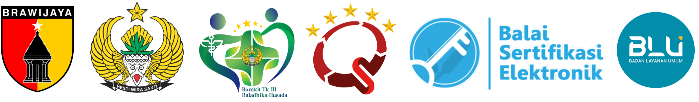

<p align="center">
  <a href="https://rsbh-jember.com" target="_blank">
    
  </a>
</p>

<h1 align="center">🏥 RS Tk. III Baladhika Husada (RS DKT Jember)</h1>
<h3 align="center">Sistem Informasi Manajemen Rumah Sakit & Portal Publik Modern</h3>

<p align="center">
  
  
  
  
  
  
  
  
</p>

---

## 📖 Tentang Proyek

**RS Tk. III Baladhika Husada (RS DKT Jember)** adalah sistem portal informasi kesehatan resmi berstandar modern yang dirancang untuk memberikan transparansi informasi, kemudahan akses layanan medis, keterbukaan publik (PPID), serta dashboard manajemen operasional rumah sakit. 

Platform ini menggabungkan performa tinggi **Laravel 12**, antarmuka estetik (*Glassmorphism & Military Green Design Language*), pelacakan analitik pengunjung *real-time*, integrasi API RSDKT, dan dukungan *Progressive Web App (PWA)*.

---

## 🌟 Fitur Unggulan

### 1. 🌐 Portal Publik & Layanan Pasien
* **Beranda Interaktif & Hero Dynamic:** Tampilan profesional dengan animasi halus (*AOS*), identitas visual militer modern, dan navigasi ramah pengguna.
* **Layanan Unggulan Digital:**
  * 🚑 **Ambulan Siaga 24 Jam:** Akses cepat pemanggilan evakuasi medis.
  * 💊 **SITERBAT (Siap Antar Obat):** Layanan pengantaran resep obat langsung ke rumah pasien.
  * 🛵 **SANTAR DEKATE:** Pengantaran dokumen dan sampel kesehatan terpadu.
* **Jadwal Dokter Spesialis & Harian:** Pemantauan ketersediaan dokter, jam praktik pagi/sore, dan poliklinik rawat jalan secara akurat.
* **Keterbukaan Informasi Publik (PPID):**
  * Dokumen Regulasi, SOP, SK, dan Laporan Kinerja Rumah Sakit.
  * Formulir Permohonan Informasi Publik online.
  * **Indeks Kepuasan Masyarakat (IKM):** Galeri interaktif laporan kepuasan pasien berkala berbasis Triwulan dengan navigasi tab modern.
* **Integrasi Data & API Rumah Sakit:**
  * 🛏️ **Monitoring Ketersediaan Tempat Tidur (*Bed Status API*).**
  * 🩺 **Jadwal Operasi & Tindakan Medis (*Live API Check*).**
  * 📰 **Sinkronisasi Berita Instagram (*Auto-feed & Caching*).**
* **SEO & Metadata Standard Kelas Atas:**
  * *Rich Snippet Schema.org (`MedicalOrganization`)* terverifikasi.
  * Optimalisasi kata kunci pencarian Google (*Search Engine Optimization*) mencakup seluruh layanan RS, BPJS, dokter spesialis, dan fasilitas Jember.

---

### 2. 📊 Panel Administrasi & Analitik Pengunjung
* **Live Visitor Analytics Dashboard:**
  * 📈 **Grafik Tren Interaktif (Multi-Timeframe):** Pantau kunjungan **Per Jam (24 Jam)**, **Per Hari (30 Hari)**, **Per Minggu**, **Per Bulan**, dan **Per Tahun**.
  * 📱 **Distribusi Perangkat (*Device Breakdown*):** Analisis pengunjung Mobile (HP), Desktop (PC), dan Tablet.
  * 🧭 **Sumber Trafik (*Traffic Source*):** Lacak asal kunjungan (Google Organik, Langsung, WhatsApp, Instagram, Facebook, TikTok).
  * 💻 **Sistem Operasi & Browser:** Deteksi platform (Android, iOS, Windows, macOS, Linux) dan peramban (Chrome, Safari, Edge, Firefox).
  * 📍 **Asal Wilayah (*Top Geographic Cities*):** Peringkat kota asal pengunjung (Jember, Surabaya, Banyuwangi, dll).
  * 📄 **Halaman Terpopuler (*Top Pages Hits*):** Peringkat halaman yang paling sering diakses.
* **Katalog & Filter Pencarian Tarif RSDKT:**
  * Filter pencarian cepat untuk kategori **Obat & Alkes**, **Tindakan Medis**, **Laboratorium**, **Radiologi**, dan **Template Paket**.
  * Filter rentang harga (Min - Max), pencarian kata kunci nama/kode obat, serta ekspor cetak PDF instan.
* **Manajemen Jadwal Dokter & Dokumen PPID:** CRUD mudah untuk memperbarui jadwal harian serta arsip berkas publik.
* **Modern Floating Mobile Dock:** Navigasi bawah melayang (*Glassmorphism Dock*) yang nyaman dan ergonomis di smartphone admin.

---

## 🛠️ Arsitektur & Teknologi

| Komponen | Teknologi yang Digunakan |
| :--- | :--- |
| **Backend Framework** | [Laravel 12.x](https://laravel.com) |
| **Bahasa Pemrograman** | PHP 8.2+ |
| **Frontend Styling** | [Tailwind CSS 3](https://tailwindcss.com) & [Bootstrap 5.3](https://getbootstrap.com) |
| **Visualisasi Data** | [Chart.js 4.x](https://www.chartjs.org) & [DataTables](https://datatables.net) |
| **Interaktivitas JS** | [Alpine.js 3](https://alpinejs.dev) & [AOS Animation](https://michalsnik.github.io/aos/) |
| **Penyimpanan Database** | MySQL / MariaDB / SQLite |
| **Format Standar Waktu** | Asia/Jakarta (Waktu Indonesia Barat / WIB) |
| **PWA & Mobile Support** | Web App Manifest & Service Worker Cache |

---

## ⚙️ Panduan Instalasi & Menjalankan Sistem

Ikuti langkah-langkah berikut untuk menjalankan proyek di lingkungan pengembangan lokal:

### 1. Kloning Repositori
```bash
git clone https://github.com/username/RSBH-2025.git
cd RSBH-2025
```

### 2. Instal Dependensi Composer & Node
```bash
composer install
npm install && npm run build
```

### 3. Konfigurasi Environment (`.env`)
Salin berkas contoh konfigurasi:
```bash
cp .env.example .env
```
Buka berkas `.env` dan sesuaikan parameter konfigurasi database serta kredensial API yang diperlukan:
```env
APP_NAME="RS Tk. III Baladhika Husada"
APP_ENV=local
APP_KEY=
APP_DEBUG=true
APP_URL=http://localhost:8000
APP_TIMEZONE=Asia/Jakarta
APP_LOCALE=id

DB_CONNECTION=mysql
DB_HOST=127.0.0.1
DB_PORT=3306
DB_DATABASE=rsbh_db
DB_USERNAME=root
DB_PASSWORD=

# Kunci Integrasi Layanan Eksternal (Gunakan placeholder di env lokal)
RSDKT_API_KEY=your-secret-api-key-here
```

### 4. Generate App Key & Migrasi Database
```bash
php artisan key:generate
php artisan migrate --seed
php artisan storage:link
```

### 5. Jalankan Server Pengembangan
```bash
php artisan serve
```
Akses aplikasi melalui peramban: `http://127.0.0.1:8000`

---

## 🔐 Keamanan & Kerahasiaan Data

* Seluruh kredensial sensitif, API Key, kata sandi database, dan token sesi **wajib disimpan di dalam file `.env`** yang telah diabaikan oleh `.gitignore`.
* Jangan pernah melakukan commit file `.env` yang berisi kredensial produksi ke repositori publik.
* Autentikasi Admin dilindungi dengan hashing *Bcrypt*, proteksi *CSRF*, serta *Security & Attribution Headers*.

---

## 👨‍💻 Pengembang & Hak Cipta

* **Sistem & Desain Dikembangkan Oleh:** **Risang Putra Pradana** *(Full-stack Web Developer)*
* **Institusi:** Rumah Sakit Tk. III Baladhika Husada (RS DKT Jember)
* **Kontak & Portofolio:** [risangputra144@gmail.com](mailto:risangputra144@gmail.com)

---

## 📄 Lisensi

Proyek ini dilisensikan di bawah lisensi [MIT License](LICENSE).
Hak Cipta &copy; 2026 RS Tk. III Baladhika Husada Jember. Seluruh Hak Cipta Dilindungi.
*Status Sistem: Produksi & Pembaruan Aktif 2026.*
